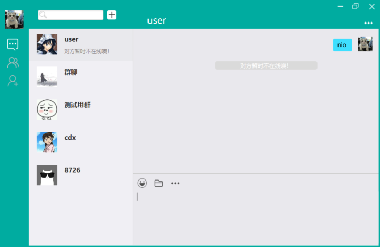

## chat! 简介

`chat!` 是基于 netty 开发的 IM 软件，作为一款即时通讯软件，毫无疑问它具备了基本的通讯能力。

`chat!` 是一款仿造微信制作的即时通讯软件，支持登录注册，好友功能，群组功能，支持文件传输， 模糊搜索等。

`chat!` ui 是基于 javafx 开发的，至于服务器的 ui，是`挪用`了[另一个开源项目的代码](https://github.com/cnRuanYF/CrazyChat)。

`chat!` 的数据库设计也是借鉴了上述项目~~(真惭愧)~~

## 界面展示

#### 登录注册界面

#### 主界面

#### 聊天界面

#### 搜索界面

#### 其他界面

更多界面在软件中自己发掘吧

## 其他

`chat!` 后面可能还会更新一波功能，例如聊天记录获取等等。不过只是一个课设，更不更新就看心情了。
